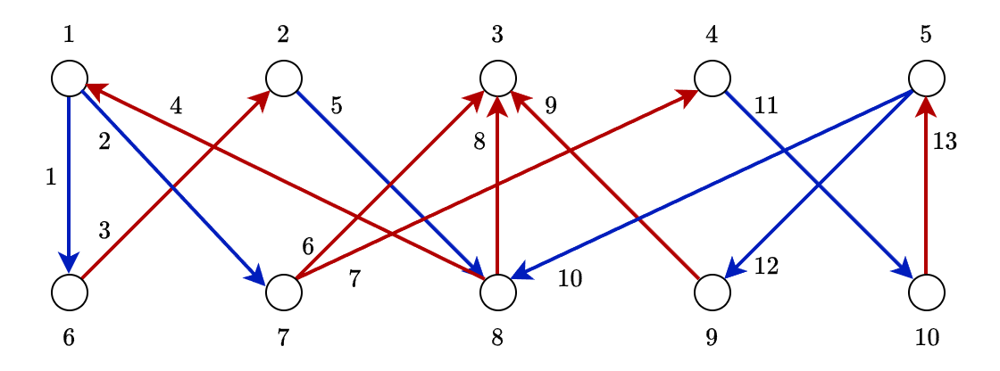

# Past Meetings

Here, recaps and additional materials for past meetings are presented.

# 2026-09-14 Mon

The PDF file with the meeting (handwritten) notes can be found [here](./assets/meetings/2026-09-14/QIUC Notes 2026-09-14.pdf)

## Quick recap

Mikhail presented an introduction to unconventional computing by considering a problem of finding paths in bipartite directed graphs, given that such paths exist.

Mikhail demonstrated standard approaches like depth-first and breadth-first search before presenting an unconventional algorithm that represented the graph's edges as binary spins and encoded the problem as a constraint satisfaction issue.

He explained how the algorithm encodes problem data in a novel way using binary spins (sigma values) and charge quantities (Q), then solves the problem by finding configurations that minimize the Q-squared energy function. The discussion covered how this approach represents a shift from conventional computing paradigms to constrained programming and unconventional computing methods.

Mikhail announced plans to explore additional algorithms and computing models in future meetings, including the V2 model of relaxation-based dynamical easing machines and other unconventional computing approaches. He also raised the question of recognizing computation in physical systems.

## Details

To illustrate a distinction between conventional and unconventional computing, we consider a problem of finding a path in a bipartite directed graph.

As a brief reminder, a graph $$\mathcal{G} = \left\{ \mathcal{V}, \mathcal{E} \right\}$$ is called *bipartite*, if its set of edges is partitioned into two parts $$\mathcal{V} = \mathcal{V}^{(1)} \sqcup \mathcal{V}^{(2)}$$, such that there are edges with endpoints in different partitions, but there are no edges with endpoints in the same partition. A graph is directed if edges have a direction: the respective pairs of incident nodes are ordered, and one pair can be regarded as the head and the other one as the tail.

Finally, we consider simple graphs: there is at most one edge connecting any two nodes.

An example of a bipartite directed graph may look like this

It is known that there is a path from node 1 to node 5. How to find it?

### Depth-first algorithm

We can employ a version of the depth-first search (DFS) and check one-by-one available option.

One such search may result in the path $1 \to 6 \to 2 \to 8 \to 1$ that returns us to the beginning. We can choose a different outgoing edge in node 8, which results in the path $1 \to 6 \to 2 \to 8 \to 3$ that cannot be continued.

After a few more attempts, we will arrive to the path $1 \to 7 \to 4 \to 10 \to 5$ that solves the problem.

### Spin algorithm

We can represent the path finding problem in a completely different manner. This representation may appear as coming from nowhere, and this is on purpose: the objective is to demonstrate how unusual may look algorithms emerging within different areas of unconventional computing. Later, we will see how this representation may be derived as branching out from studying a different problem (discrete tomography).

We represent edges as binary variables, $$\sigma_m \in \left\{ -1, 1 \right\}$$

More coming soon &#x2026;
