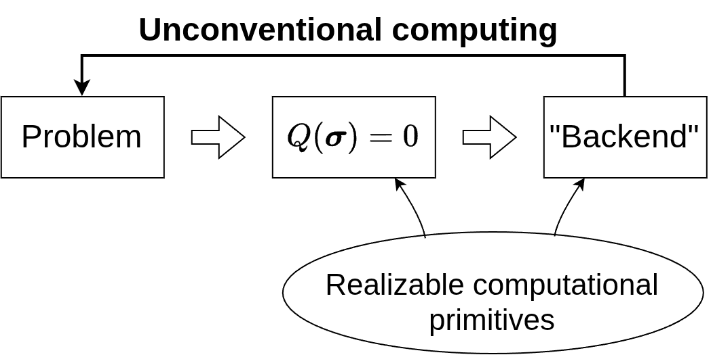
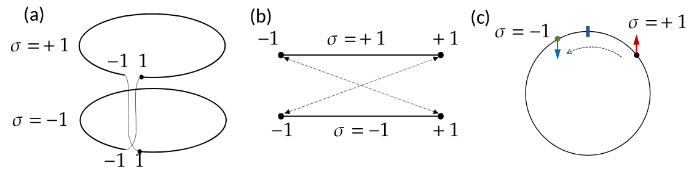

# 2026-09-21 Mon: Unconventional computing and V-2 model (WIP)

The PDF file with the meeting (handwritten) notes can be found [here](../assets/meetings/2026-09-21/QIUC Notes 2026-09-21.pdf).

## Approaches: traditional vs unconventional

When we reformulated the problem about a path in bipartite directed graph as finding a spin configuration yielding $Q(\boldsymbol{\sigma}) = 0$, where $Q(\boldsymbol{\sigma})$ is a linear function of spin variables, we did not really presented a solution. Finding the required spin configuration is a non-trivial task. How non-trivial? It may be meaningful to reformulate $Q(r; \boldsymbol{\sigma}') = 0$ (with the respective limitations imposed on initial $Q(r; \boldsymbol{\sigma})$) as a problem about a path in a bipartite directed graph and then apply well-understood algorithms, such as depth-first or breadth-first searches. We went the whole circle, and the spin representation may appear as a mere linguistic exercise.

Suppose, however, that we have an alternative, possibly more direct, way to solve the $Q(\boldsymbol{\sigma}) = 0$ problem. Then, the status of spin representations changes drastically, as they, indeed, provide a novel way to perform computations.

There are two ways how to look at this. One is to regard $Q(\boldsymbol{\sigma}) = 0$ as an established computational primitive, reliably and efficiently performed elementary operation; for example, enabled by a particular physical system.

Another perspective is complementary. Given a system with non-trivial behavior, we can try to identify and distill particular computational primitive, thus enabling new computational opportunities, for instance, more efficient information processing techniques.

Unconventional computing covers both these perspectives.

## In search for a backend

We presented the problem of finding a path in a bipartite directed graph as finding such spin configuration $\boldsymbol{\sigma}^\star$ that $Q(r; \boldsymbol{\sigma}^\star) = 0$ for all $r$, the nodes of the original graph, where

$$ Q(r; \boldsymbol{\sigma}) = \sum_{m = 0}^M q_m(r) \sigma_m $$

and $m = 0$ corresponds to the auxiliary fixed spin $\sigma_0 \equiv 1$. Slightly extending the problem, we can write the resultant system of equations as a single equation

$$ \boldsymbol{\sigma}^\star = \arg\min_{\boldsymbol{\sigma}} \sum_{r} Q^2(r; \boldsymbol{\sigma}). $$

The notation $\arg\min_{x} f(x)$ denotes that we need the argument, at which $f(x)$ reaches its minimum, not the minimum value itself.

The transition from a system of equation to the single equation is justified by the observation that $\sum_{r} Q^2(r; \boldsymbol{\sigma})$ reaches $0$ at such $\boldsymbol{\sigma}^\star$ when all $Q(r; \boldsymbol{\sigma}^\star) = 0$, as required, and the sum of squares of real numbers cannot be smaller than $0$.

At the same time, the transition from the system of equations to the single equation is not one-to-one. We will discuss these subtleties later.

Expanding $Q(r; \boldsymbol{\sigma})$, we obtain

$$ \boldsymbol{\sigma}^\star = \arg\min_{\boldsymbol{\sigma}} \left[ \sum_{r, m} q_m(r)^2 + \frac{1}{2} \sum_{m \ne n} A_{m,n} \sigma_m \sigma_n\right], $$

where $A_{m,n} = 2 \sum_{r} q_m(r) q_n(r)$.

The first term in the square brackets does not depend on the spin configuration, and, therefore, it only shifts the minimum value without affecting $\boldsymbol{\sigma}^\star$. Thus, we have

$$ \boldsymbol{\sigma}^\star = \arg\min_{\boldsymbol{\sigma}} \frac{1}{2} \sum_{m \ne n} A_{m,n} \sigma_m \sigma_n. $$

In statistical physics, the function that we minimize here is identified as the Ising Hamiltonian, energy of an Ising model, a network of coupled binary spins with couplings given by the network weighted adjacency matrix $A_{m,n}$. The spin configuration corresponding to the energy minimum is called the *ground state*.

The relation with the path problem suggests that we can regard finding the ground state as the main computational primitive. This approach can be called the *Ising model of computation*. Slightly generalizing, we will call realizations of this model, either in hardware or software or as theoretical models, *Ising machines*.

The relationship with the Ising model is convenient for considering coupling-related questions. As we will see later, for investigating computational properties, other approaches may be more convenient. Consequently, the machinery developed in statistical physics for studying Ising model fortunately (or unfortunately) is not necessary for investigating this approach to computation.

## Relaxation-based dynamical Ising machines

While the idea about an Ising machine as a black box may be handy for developing spin representations of various data processing problems, practical realizations of these representations crucially depend on implementations of Ising machines.

There is a broad variety of Ising machines based on different operating principles. Here, we consider a particular class such machines called relaxation-based dynamical Ising machines (R-DIM) developed specifically with the intent to explore a broad variety of techniques for achieving the solution of spin-formulated problems.

The distinguishing feature of the most developed subclass of R-DIM is the notion of relaxed spin. The binary spin variables are represented by a pair, comprising the binary and continuous components,

$$ \sigma \to \left( \sigma, X \right) , $$

where $X \in [-1, 1]$. This representation is supplemented by the convention: whenever the continuous component of the relaxed spin is about to cross the boundary of the interval, the relaxed spin is translated to the opposite boundary and the binary component changes its sign. The figure below shows different ways how to regard this convention. Perhaps, considering the relaxed spin as an arrow on a circle is the most convenient.

Formally, the phase space of a single relaxed spin can be defined as $\left\lbrace -1, 1 \right\rbrace \times [-1, 1] / \sim$

## V-2 model

Details coming soon &hellip;
