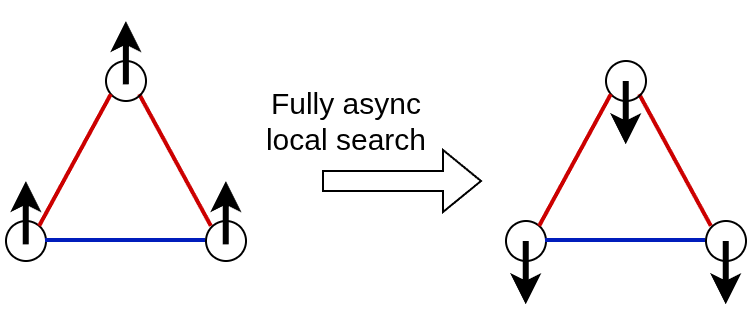

# 2026-10-05 Mon: Parallelization of local search (WIP)

The PDF file with the meeting (handwritten) notes can be found [here](../assets/meetings/2026-10-05/QIUC Notes 2026-10-05.pdf).

## Reimplementation of known aglorithms

Previously, we saw how unconventional computing enables new algorithms and information processing techniques. Today, we focused on yet another "application": reimplementation of already known algorithms. Specifically, we looked at how an algorithm that may appear principally sequential can be recast in a parallelizable form.

## Maximum cut problem

The maximum cut problem simplifies many discussions related to the states of spin networks, and, therefore, it is worth proper introduction.

This problem inquires about such a partitioning of nodes in a weighted graph that delivers the maximum total weight of edges connecting nodes in different parts (cut edges). As figure below illustrates, binary spins naturally fit to describe this problem. We assign spins to individual graph nodes so that $\sigma_m = 1$ if node $m$ is in part 1, and $\sigma_m = -1$ if node $m$ is in part 2.

")

Given the spin distribution, we can write the cut indicator function: for edge $(m,n)$, we have $\chi_{m,n}(\boldsymbol{\sigma}) = (1 - \sigma_m \sigma_n) /2$. Indeed, if nodes $m$ and $n$ belong the same partition, then $\sigma_m \sigma_n = 1$, and we have $\chi_{m,n}(\boldsymbol{\sigma}) = 0$, and so forth.

If the graph weighted adjacency matrix is $A_{m,n}$, then the total cut weight is the weighted sum of the cut indicator

$$ C(\boldsymbol{\sigma}) = \frac{1}{4} \sum_{m,n} A_{m,n} \left( 1 - \sigma_m \sigma_n \right), $$

where the factor $1 /4$ accounts for the fact that our sum runs over all edges twice.

We see that the cut is directly related to the Ising Hamiltonian

$$ C(\boldsymbol{\sigma}) = \frac{W}{2} - \frac{1}{2} H(\boldsymbol{\sigma}), $$

where $W = \sum_{m,n} A_{m,n} /2$ is the total weight of the graph edges.

Thus, finding the maximum partition of the graph is equivalent to finding the ground state of the Ising model.

## Local search

Local search is a general purpose algorithm for heuristical solving optimization problems through improving the objective function locally until we can no longer improve. Here, we consider its version that ensures that inverting any *single* spin will not increase cut, and, therefore, it is also called 1-opt local search.

Local search work as follows. Given the spin configuration $\boldsymbol{\sigma}$, we look for such a spin that could be inverted and improve cut. Say, we are looking at the node $l$. We consider

$$ \delta C_l(\boldsymbol{\sigma}) = C(\boldsymbol{\sigma} \vert_{\sigma_l \to -\sigma_l}) - C(\boldsymbol{\sigma}), $$

where $\boldsymbol{\sigma} \vert_{\sigma_l \to -\sigma_l}$ denotes the configuration obtained after inverting $\sigma_l$. In other words, $\delta C_l(\boldsymbol{\sigma})$ has the meaning of how cut changes after inverting spin $\sigma_l$. After some algebra, we obtain

$$ \delta C_l(\boldsymbol{\sigma}) = \sum_{n} A_{l,n} \sigma_l \sigma_n, $$

or $\delta C_l(\boldsymbol{\sigma}) = W_{l}(\mathrm{uncut}) - W_{l}(\mathrm{cut})$, that is the difference between the total weight of uncut and cut edges incident to node $l$.

If $\delta C_l(\boldsymbol{\sigma}) > 0$, we modify the configuration $\sigma_l \to -\sigma_l$, and return to checking now updated configuration.

If there are no nodes with $\delta C_l(\boldsymbol{\sigma}) > 0$, we are done.

As a self-check question: it is not difficult to see that starting from an arbitrary (think random) spin configuration, local search completes in a finite number of steps.

The outcome of local search is such partition that for each node the total weight of incident cut edges is not smaller than that of uncut. Alternatively, we can understand this as a spin configuration that cannot be improved by inverting any single spin, or as a configuration that does not have a better one within the Hamming distance one (hence, 1-opt). The property $\delta C_l(\boldsymbol{\sigma}) \leq 0$ for all $l$ of the final configuration can be regarded as the *stability* condition of the spin configuration with respect to 1-opt local search.

It is not difficult to see that trying to run the local search procedure simultaneously for multiple nodes may not necessarily lead to cut improvements. As the figure below demonstrates, this may even make the algorithm non-convergent.

## Cube relaxation of the spin model

It turns out, however, that we *can* perform local search in a parallel. More precisely, we can reproduce the results of local search within a parallelizable approach.

To this end, we consider a simple relaxation of the maximum cut problem by rewriting the cut function for continuous variables changing over the *interval* $[-1, 1]$:

$$ C(\boldsymbol{\sigma}) \to C(\boldsymbol{\xi}) = \frac{1}{4} \sum_{m,n} A_{m,n} \left( 1 - \xi_m \xi_n \right), $$

where $\xi_m \in [-1, 1]$.

Enforcing the condition $A_{m,m} = 0$ (for binary spins this was not necessary as these terms do not contribute), we observe that $C(\boldsymbol{\sigma})$ is a poly-linear (multi-affine) function of $\xi_m$. Being maximized over the cube $[-1,1]^N$, it reaches its maxima at the extreme points of the body, the cube's vertices.

It can be seen by assuming that the maximum is reached elsewhere, so that not all $\xi_m = \pm 1$, considering one of such "in-between" $\xi_l$ and applying the condition $\partial^2 C(\boldsymbol{\xi}) / \partial \xi_l^2 = 0$. It should be noted that if the maximum is indeed reached at some $-1 < \xi_l < 1$, this implies that the maximum value does not depend on $\xi_l$ and we can freely choose it either $1$ or $-1$.

## Dynamical realization

gradient descent could be used to find these maximum values.

considering perturbations in the form of differences between two functions.

## Parallelization:  Dynamics vs Decision

reformulating an algorithm as a dynamical system can make it parallelizable,

Local search is inherently sequential because it relies on comparing the current state with a future state after a flip, which creates race conditions in parallel execution.

this approach could potentially parallelize other algorithms that were previously considered not parallelizable, though more work is needed to apply this principle to other optimization problems.

Details coming soon &hellip;
